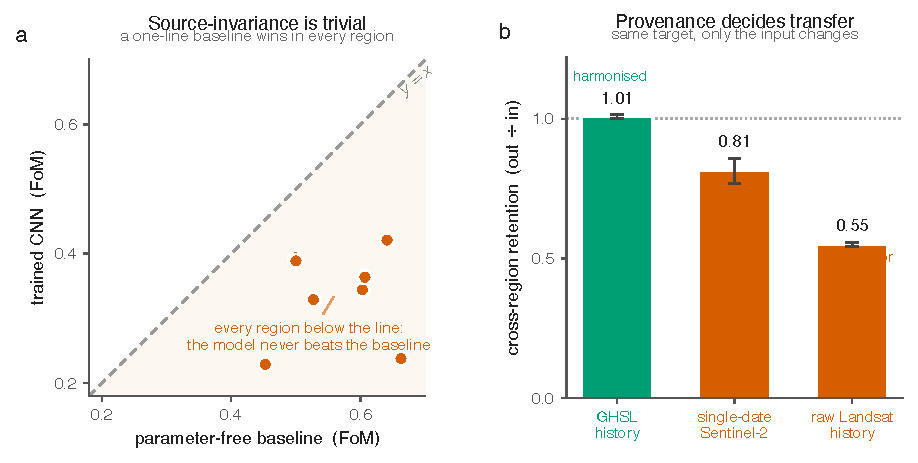
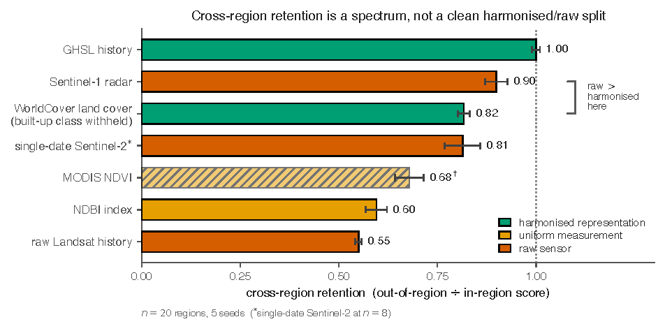

# Cross-Region Source-Invariance in Earth Observation

[](https://github.com/rohanbalixz/Cross-Region-Source-Invariance-in-Earth-Observation/actions/workflows/ci.yml)
[](LICENSE)
[](https://www.python.org/)

Code, evaluation receipts, and figures for a study of **what actually determines
whether a geospatial model transfers from one region to another**.

<p align="center"></p>
<p align="center"><em>Left: a parameter-free baseline beats the trained model in every region.
Right: holding the target fixed, cross-region retention falls from a harmonised product to a raw sensor.</em></p>

The central tool is the full *source-by-target transfer matrix*: train one model
per region and evaluate every model on every region. Reading that matrix — across
twenty world regions, eight prediction tasks, and several input representations —
yields two findings:

1. **Transfer is decided by the data, not the model.** Which region you *test on*
   and which *input* you feed a model explain almost all of the cross-region
   variation in score; which region you *trained on* explains almost none. On the
   temporal tasks a parameter-free extrapolation of each region's recent past
   matches or beats every trained model, so the apparent cross-region
   "generalisation" is largely a shallow, globally-shared signal plus a
   metric artefact, not learned skill.

2. **When the input is held fixed and swapped, retention moves along a spectrum**
   set by how *region-invariant the input-to-label mapping* is — globally
   harmonised products sit near the top, raw single-sensor inputs near the bottom,
   and a physically-invariant raw signal (SAR) surprisingly high. This axis is
   measurable directly from the data, independently of any trained model.

<p align="center"></p>
<p align="center"><em>Holding the target and model fixed and swapping only the input: retention is a
spectrum set by how region-invariant the input-to-label mapping is, not a clean harmonised/raw split.</em></p>

This repository contains everything needed to reproduce the analysis: the
acquisition and preprocessing pipeline, the training/evaluation code, every
result receipt (`results/metrics/`), and the figure-generation scripts.

> **Status.** The accompanying manuscript is under review and is **not** included
> here. The figures and numerical receipts are released so the results can be
> inspected and reproduced.

---

## Repository structure

```
scripts/
  acquire/      Stream and align the raw inputs (GHSL, Landsat, Sentinel-1/2,
                MODIS NDVI/LST, ESA WorldCover, Copernicus DEM, OpenStreetMap)
                from the Microsoft Planetary Computer and other open sources.
  covariates/   Per-tile terrain, settlement-morphology, and transport covariates.
  preprocess/   Build the per-city GeoTIFF tiles used for training and evaluation.
  eval/         The experiments: the source-by-target transfer matrices, the
                parameter-free deflation baseline, the change-rate confound
                analysis, the input-swap (provenance) controls, foundation-model
                controls, robustness sweeps, and the PANGAEA re-analysis.
  figures/      Scripts that regenerate every figure from the receipts/data.
results/
  metrics/      One JSON "receipt" per experiment — the actual reported numbers.
figures/        Pre-rendered figures (PDF).
requirements.txt
LICENSE         Apache-2.0
```

The Python package is imported as `scripts.*`; run modules with `python -m`, e.g.
`python -m scripts.eval.morph_baseline`.

## Installation

```bash
python -m venv .venv && source .venv/bin/activate
pip install -r requirements.txt
```

Tested with Python 3.11–3.13. Training uses PyTorch; the code runs on CPU, CUDA,
or Apple-Silicon MPS. The Prithvi-EO foundation-model control additionally needs
the [`prithvi_mae`](https://github.com/NASA-IMPACT/hls-foundation-os) package and
the official HLS pretrained weights (see that script's docstring).

## Data

The raw inputs are large third-party Earth-observation products and are **not**
redistributed here (they keep their own licenses). They are streamed and aligned
on demand by the acquisition scripts — no credentials are required for the
Planetary Computer sources:

```bash
# example: acquire one city across the input modalities
python -m scripts.acquire.ghsl            --city lagos
python -m scripts.acquire.landsat_history --city lagos
python -m scripts.acquire.sentinel1       --region ssa
python -m scripts.acquire.worldcover_aligned --region ssa
```

Full acquisition for all twenty regions is on the order of tens of gigabytes and
a few hours of streaming. Preprocessing then builds the per-city tiles:

```bash
python -m scripts.preprocess.build_city_tiffs --region ssa
```

## Verify the headline results in seconds (no data needed)

`verify.py` re-derives the main numbers from the committed receipts — including
recomputing the PANGAEA variance decomposition from the published score table —
using only `numpy`/`scipy`:

```bash
pip install -r requirements-verify.txt
python verify.py        # 13/13 checks, exit 0
```

This is what CI runs on every push.

## Reproducing the full results

Every reported number is written to a JSON receipt under `results/metrics/`
([indexed here](results/metrics/README.md)), so the headline results can be
inspected without retraining. Representative entry points:

| Result | Command | Receipt |
|---|---|---|
| Source-by-target transfer matrix | `python -m scripts.eval.transfer_matrix` | `transfer_matrix_cnn.json` |
| Twenty-region matrix | `python -m scripts.eval.extend_matrix_n20` | `full_matrix_n20_cnn.json` |
| Deflation (parameter-free baseline) | `python -m scripts.eval.morph_baseline` | `morph_baseline.json` |
| Pooled / capacity sweep | `python -m scripts.eval.pooled_resourced` | `pooled_resourced.json` |
| Change-rate confound | `python -m scripts.eval.multitask_difficulty` | `confound_n20_allpix.json` |
| Covariate analysis | `python -m scripts.eval.covariate_null` | `covariate_null.json` |
| Input-swap / provenance controls | `scripts.eval.{sar,ndbi,worldcover_builtup,landsat_temporal,lst_provenance}_matrix` | `*_multiseed.json` |
| Mapping-stability probe | `python -m scripts.eval.mapping_stability` | `mapping_stability.json` |
| Foundation-model controls | `scripts.eval.{fm_seg_matrix,prithvi_seg_matrix}` | `fm_seg_*.json`, `prithvi_seg_matrix.json` |
| Domain-generalisation baseline | `python -m scripts.eval.groupdro` | `groupdro.json` |
| PANGAEA re-analysis | `python -m scripts.eval.pangaea_reanalysis` | `pangaea_reanalysis.json` |

Figures are regenerated from the receipts/data, e.g.:

```bash
python scripts/figures/make_fig_dissociation.py   # writes figures/fig_dissociation.pdf
```

(The study-area map needs a Natural Earth 1:110m countries shapefile; set
`$NATURALEARTH_SHP` or place it at `data/naturalearth_lowres/`.)

## License and attribution

Code is released under the **Apache-2.0** license (`LICENSE`).

The benchmark is built on open third-party data and methods, each under its own
terms — including GHSL (JRC), ESA WorldCover, Sentinel-1/2 (ESA/Copernicus),
Landsat (USGS), MODIS (NASA), Copernicus DEM, OpenStreetMap, the DINOv2 and
Prithvi-EO foundation models, and the PANGAEA benchmark. These are not
redistributed here; please cite the originals when using them.

© 2026 Rohan Bali.
